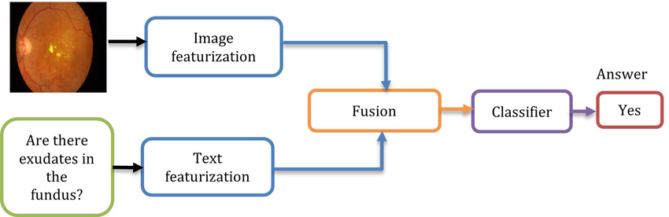
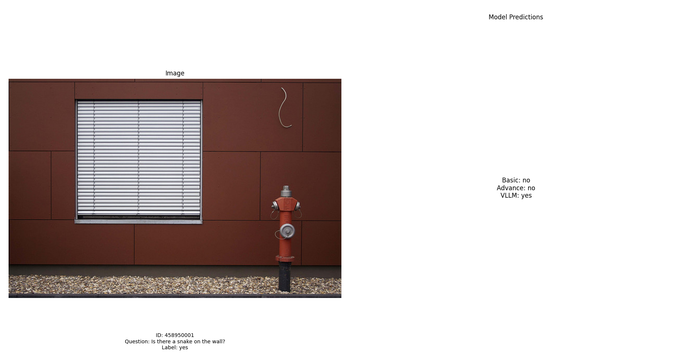
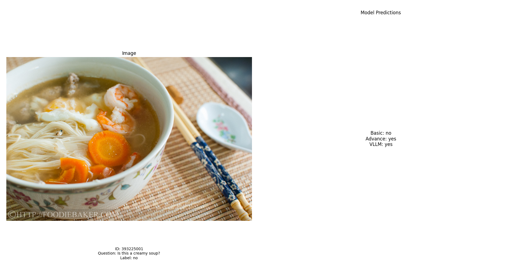
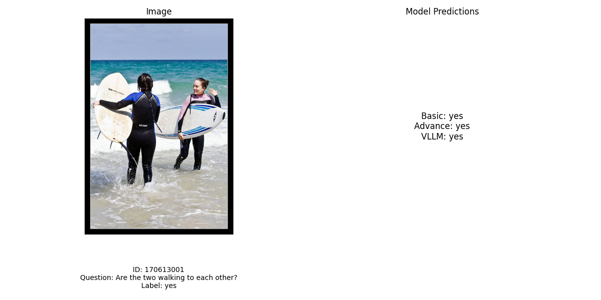
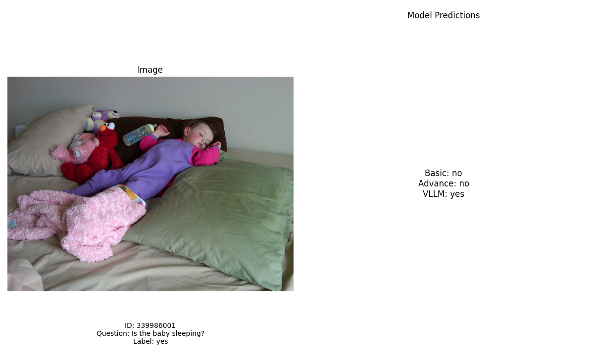
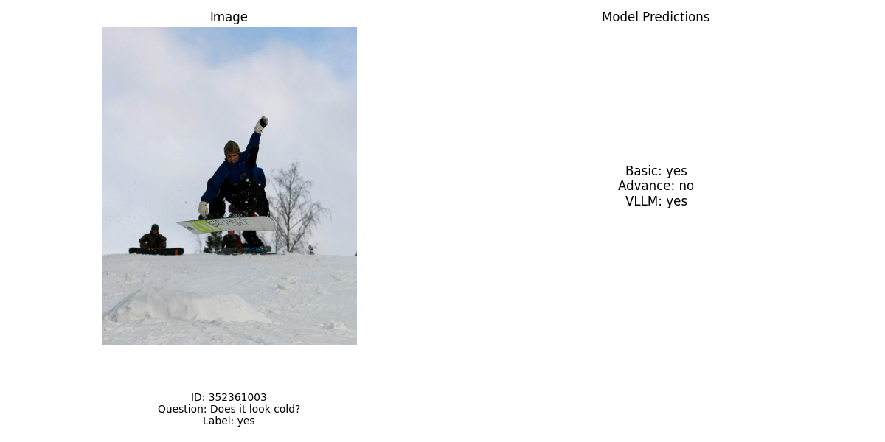
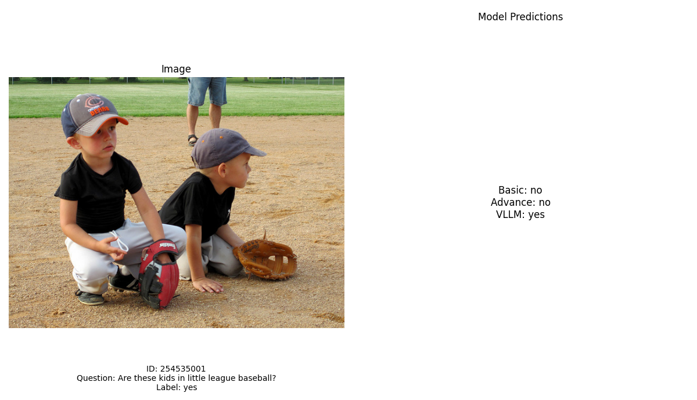

# VisualQuestionAnswering

- TODO: 
+ write readme about the project
+ train llava model (In the future)

# Project Overview
This project focuses on building Visual Question Answering (VQA) models capable of answering yes/no questions based on input images. 
The models are trained using the VQA COCO dataset and aim to improve understanding of image content through a combination of computer vision (CV) and natural language processing (NLP) techniques.

To ensure a comprehensive evaluation, three different models are implemented, and their results are compared. 
This approach helps analyze their effectiveness in understanding images and accurately answering binary questions, as well as evaluating the efficiency of different methodologies.

# Model Details

The VQA model follows a traditional structure (as illustrated in Figure 3), which consists of three key components:

- **Feature Extraction**: Extracts feature vectors representing both the textual data (question) and the visual data (image) from the input.

- **Feature Fusion**: Combines the extracted features from both the image and the question into a single vector, forming a unified representation.

- **Answer Classifier**: Predicts the true or false answer based on the fused feature vector.



### 1. Basic Model

- **Image Encoder**: CNN-based feature extractor
- **Text Encoder**: LSTM for encoding the question
- **Fusion**: Concatenation of image and text features
- **Classifier**: Fully connected layers

### 2. Advanced Model

- **Image Encoder**: ViT (Vision Transformer) - google/vit-base-patch16-224
- **Text Encoder**: RoBERTa - roberta-base
- **Fusion**: Concatenation of image and text features
- **Classifier**: Fully connected layers

### 3. Visual Large Language Model (LLM-Based VQA)

- **Model**: LLaVA-1.5-7B - llava-hf/llava-1.5-7b-hf

# Dataset
- The dataset used is from: https://visualqa.org/
- Download the dataset and extract it to the dataset folder ([Dataset Structure](#dataset-structure))

# How to run


+ Run the preprocess_yes_no_dataset.py to get new json files for train/val/test set

    ```python
    python data_preprocess/preprocess_yes_no_dataset.py
    ```

+ Train basic model

    ```python
    python train/train_basic.py
    ```

+ Train advance model

    ```python
    python train/train_advance.py
    ```

+ Evaluate visual large language model

    ```python
    python train/train_vllm.py
    ```

+ Run tensorboard 

    ```bash
    tensorboard --logdir=output/basic_logs
    ```

    ```bash
    tensorboard --logdir=output/advance_logs
    ```

# Project Structure
###  Folder Structure
```
.
├── app.py
├── data_preprocess
│   ├── generate_dataset.py
│   └── generate_yes_no_dataset.py
├── dataset
├── docs
│   ├── advance_model
│   ├── basic_model
│   ├── results
│   └── vllm_model
├── model
│   ├── utils.py
│   ├── vqa_dataset.py
│   ├── VQAModelAdvance.py
│   ├── VQAModelBasic.py
│   └── VQAVLLM.py
├── output
│   ├── basic_logs
│   ├── advance_logs
│   ├── basic_model.pth
│   ├── advance_model.pth
│   └── vllm_checkpoint.json
├── README.md
├── requirements.txt
├── test.py
├── train
│   ├── train_advance.py
│   ├── train_basic.py
│   ├── train_vllm_checkpoint.py
│   └── train_vllm.py
├── utils
│   ├── config.yaml
│   ├── huggingface.py
│   └── utils.py
├── visualize
│   ├── compare_models.py
│   └── sample_data.py
└── VQA_project.pdf
```

### Dataset Structure
```
.
└──  dataset
    ├── generated
    │   ├── test2015_images.json
    │   ├── test_dataset.json
    │   ├── test_question_image.json
    │   ├── test_questions.json
    │   ├── train2014_images.json
    │   ├── train_dataset.json
    │   ├── train_question_image.json
    │   ├── train_questions.json
    │   ├── val2014_images.json
    │   ├── val_dataset.json
    │   ├── val_question_image.json
    │   └── val_questions.json
    ├── generated_yes_no
    │   ├── test2015_images.json
    │   ├── test_dataset.json
    │   ├── test_question_image.json
    │   ├── test_questions.json
    │   ├── train2014_images.json
    │   ├── train_dataset.json
    │   ├── train_question_image.json
    │   ├── train_questions.json
    │   ├── val2014_images.json
    │   ├── val_dataset.json
    │   ├── val_question_image.json
    │   └── val_questions.json
    ├── test2015
    ├── test2015.zip
    ├── train2014
    ├── train2014.zip
    ├── v2_Annotations_Train_mscoco
    │   ├── struct.txt
    │   └── v2_mscoco_train2014_annotations.json
    ├── v2_Annotations_Val_mscoco
    │   ├── struct.txt
    │   └── v2_mscoco_val2014_annotations.json
    ├── v2_Questions_Test_mscoco
    │   ├── v2_OpenEnded_mscoco_test2015_questions.json
    │   └── v2_OpenEnded_mscoco_test-dev2015_questions.json
    ├── v2_Questions_Train_mscoco
    │   ├── struct.txt
    │   └── v2_OpenEnded_mscoco_train2014_questions.json
    ├── v2_Questions_Val_mscoco
    │   └── v2_OpenEnded_mscoco_val2014_questions.json
    ├── val2014
    └── val2014.zip
```

# Results

## Training progress

- Basic model

    

- Advance model

    

- Both

    

## Training Results
- Accuracy results

    

    

    

- Basic model - Accuracy: 0.56
- Advance model - Accuracy: 0.53
- Visual Language model - Accuracy: 0.49

| **Model**   | **Basic** | **Advance** | **Visual Language** |
|-------------|-----------|-------------|---------------------|
| **Accuracy**| 0.56      | 0.53        | 0.49                |

## Results Visualization 









# Conclusion
- In this project, three Visual Question Answering (VQA) models were developed and evaluated to answer yes/no questions based on images. 
Interestingly, the Basic Model, with its simpler architecture using a CNN and LSTM, achieved a competitive accuracy of 0.56, outperforming the more complex Advanced Model (accuracy: 0.53) and the Visual Large Language Model (VLLM) (accuracy: 0.49). While the Advanced Model utilized sophisticated architectures like ViT and RoBERTa, it did not significantly surpass the Basic Model, underscoring the effectiveness of simpler approaches for this task. On the other hand, the VLLM, despite not being fine-tuned or trained specifically for this task, still delivered a reasonable performance, showcasing the robustness and generalization capabilities of large pre-trained visual-language models. These results highlight that while advanced architectures hold potential, simpler models can remain highly effective, and pre-trained models like VLLM can provide strong baselines without additional training.

# Future Work

- Fine-tuning LLaVA 7B on domain-specific datasets
- Exploring larger vision-language models for improved reasoning
- Expanding dataset coverage to include open-ended questions
